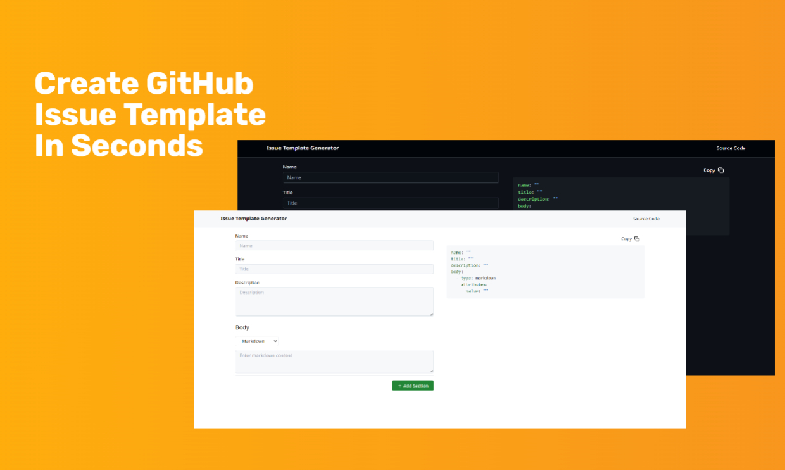

# GitHub Issue Template Generator

A tool to generate custom GitHub issue templates. This project helps you create issue templates with sections like Markdown, Input, Textarea, Dropdown, and Checkboxes, allowing for easy configuration of your project's issue management.

Website: https://happer64bit.github.io/github-issue-template-generator

## Donation

If you find this project helpful, consider supporting its development by making a donation. Your contributions help cover the costs of maintaining and improving the tool, ensuring it continues to be available for everyone.

* Solana: `EK48PtUR2vXA7wTzUiNuUpmS6peXWWmmrqncNxFn3sL7`
* ERC20: `0x6e47eDAdA0A25f38f2c2e3851256E455ed17A8A0`

Thank you for your support!
